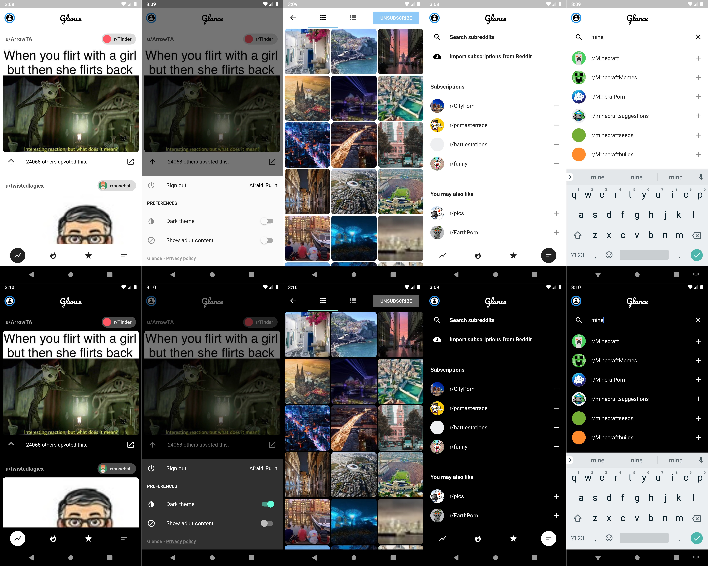

    <h1>Glance</h1>
    

## About the app

Glance is an unofficial client for Reddit. However, it allows you to only browse through media posts such as photos and videos. It's purpose is mainly to lurk majestic photos subreddits as well as memes, videos and gifs.

### Features

- Subscribing to subs (separately from your Reddit account)
    - Importing subscriptions from your Reddit account
- Upvoting (click the arrow or double-tap)
- Downloading photos
- Browsing only certain subreddit
- Dark mode

## Related websites

- [Landing page](https://reddigram.wolszon.me)
- [r/GlanceApp](https://www.reddit.com/r/GlanceApp/)

## Related repositories

- [Glance API repository](https://github.com/Albert221/GlanceApi)
- [Landing page repository](https://github.com/Albert221/GlanceLanding)

